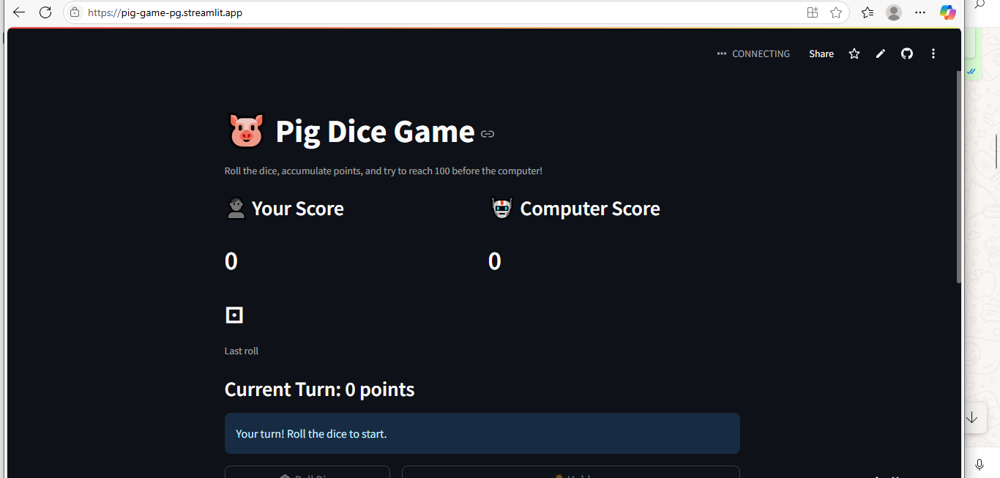
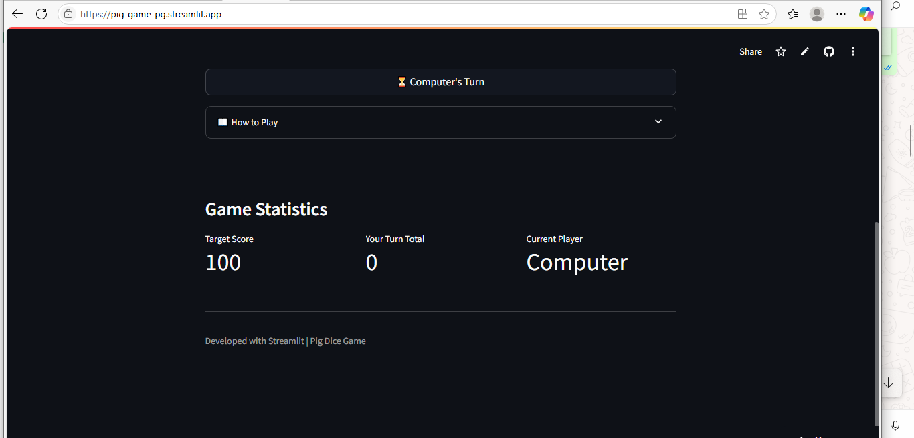

# 🐷 Pig Dice Game

Experience the timeless fun of Pig Dice in an engaging, interactive format using Python and Streamlit. Roll the dice, stack up points, and challenge a computer rival in a thrilling race to 100!

## Features ✨
- 🎮 Play against computer AI with strategic decision-making
- 🎲 Real-time dice visualization with emoji graphics
- 📊 Score tracking and game statistics
- ⏳ Computer turn simulation with realistic delays
- 📖 Game rules documentation
- 📱 Responsive design for all devices

## Screenshots 📸
| Image 1 | Image 2 |
|------------------|----------------|
|  |  |

## How to Play 🎮
1. Roll the dice to accumulate points
2. Hold to bank your points and end your turn
3. Avoid rolling a 1 or you lose your turn points
4. First to reach 100 points wins!
5. Computer plays strategically - stops at 20+ points per turn

## Tech Stack 🛠
- *Frontend*: Streamlit
- *Backend*: Python 3
- *Key Modules*: 
- streamlit for UI
- random for dice rolls
- time for turn simulation

## Installation ⚙
1. Clone repository:
bash
git clone https://github.com/youngdrizzy1/Pig-Game
cd Pig-Game

2. Install dependencies:
bash
pip install streamlit

3. Run the application:
bash
streamlit run app.py

## Live Demo 🌐
Try the live version: [Pig-Game-App](https://pig-game-pg.streamlit.app/)

## Connect with Me 👋
[LinkedIn](https://www.linkedin.com/in/wisdom-douglas/) | 
[GitHub](https://github.com/youngdrizzy1)
